# Icon Legend

This page documents the weather and metric icons used by the UI.

Source of truth in code:

- `Tempest.UI/ViewModels/MainWindowViewModel.cs` (`GetWeatherIcon`)

## Weather Icon Catalog

| Preview | Key / File | Represents |
|---|---|---|
| 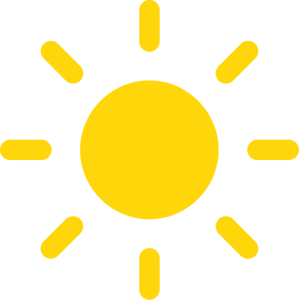 | `clear-day` / `clear-day.png` | Clear daytime conditions |
|  | `clear-night` / `clear-night.png` | Clear nighttime conditions |
|  | `cloudy` / `cloudy.png` | Overcast or mostly cloudy conditions |
| 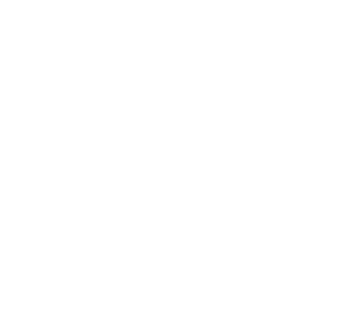 | `foggy` / `foggy.png` | Fog or reduced visibility |
| 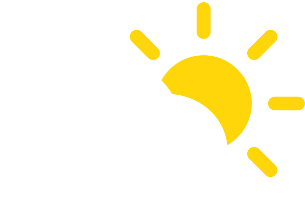 | `partly-cloudy-day` / `partly-cloudy-day.png` | Partly cloudy daytime conditions |
|  | `partly-cloudy-night` / `partly-cloudy-night.png` | Partly cloudy nighttime conditions |
| 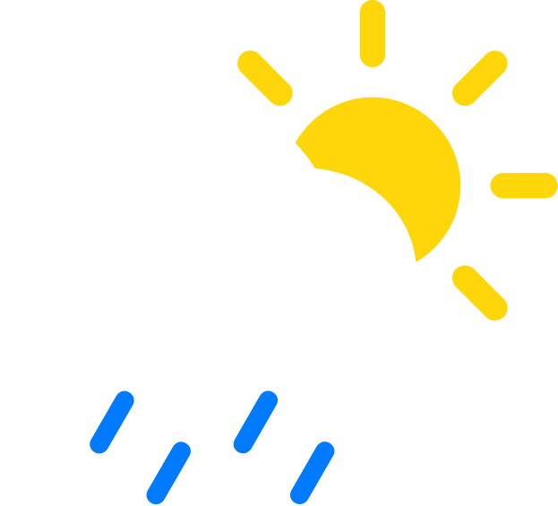 | `possibly-rainy-day` / `possibly-rain-day.png` | Chance of rain during daytime |
| 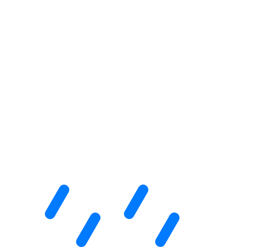 | `possibly-rainy-night` / `possibly-rany-night.png` | Chance of rain during nighttime |
|  | `possibly-sleet-day` / `possibly-sleet-day.png` | Chance of sleet during daytime |
| 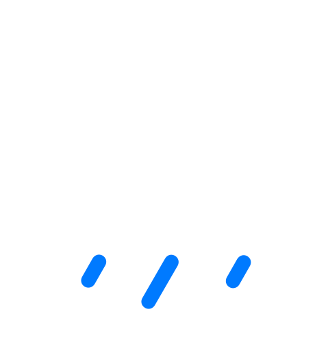 | `possibly-sleet-night` / `possibly-sleet-night.png` | Chance of sleet during nighttime |
|  | `possibly-snow-day` / `possibly-snow-day.png` | Chance of snow during daytime |
|  | `possibly-snow-night` / `possibly-snow-night.png` | Chance of snow during nighttime |
| 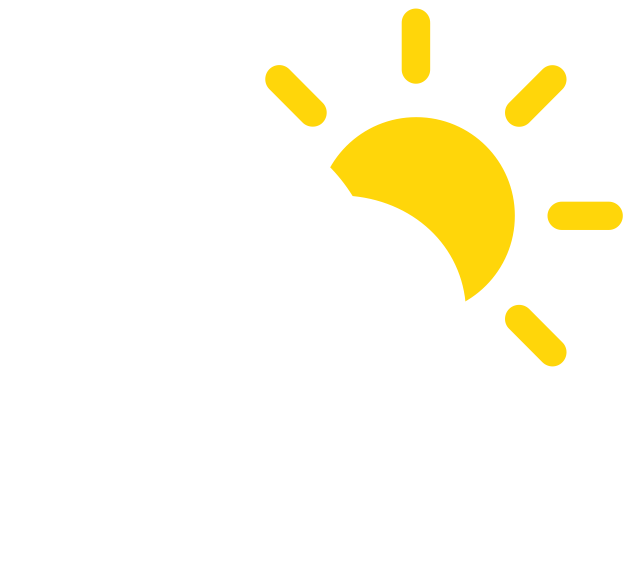 | `possibly-thunderstorm-day` / `possibly-thunderstorm-day.png` | Chance of thunderstorms during daytime |
| 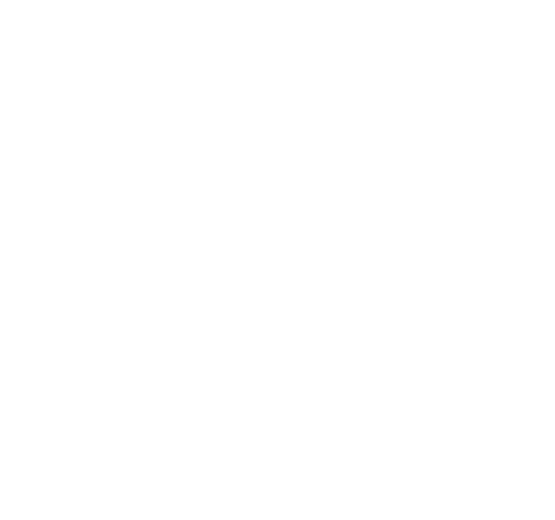 | `possibly-thunderstorm-night` / `possibly-thunderstorm-night.png` | Chance of thunderstorms during nighttime |
| 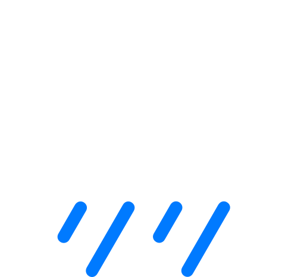 | `rainy` / `rainy.png` | Active rain |
|  | `sleet` / `sleet.png` | Active sleet or hail-like frozen precipitation |
| 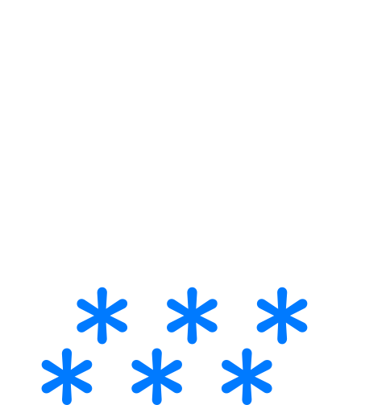 | `snow` / `snow.png` | Active snowfall |
| 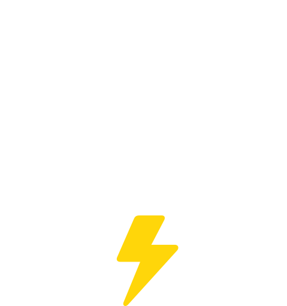 | `thunderstorm` / `thunderstorm.png` | Thunderstorm or dry-lightning state |
| 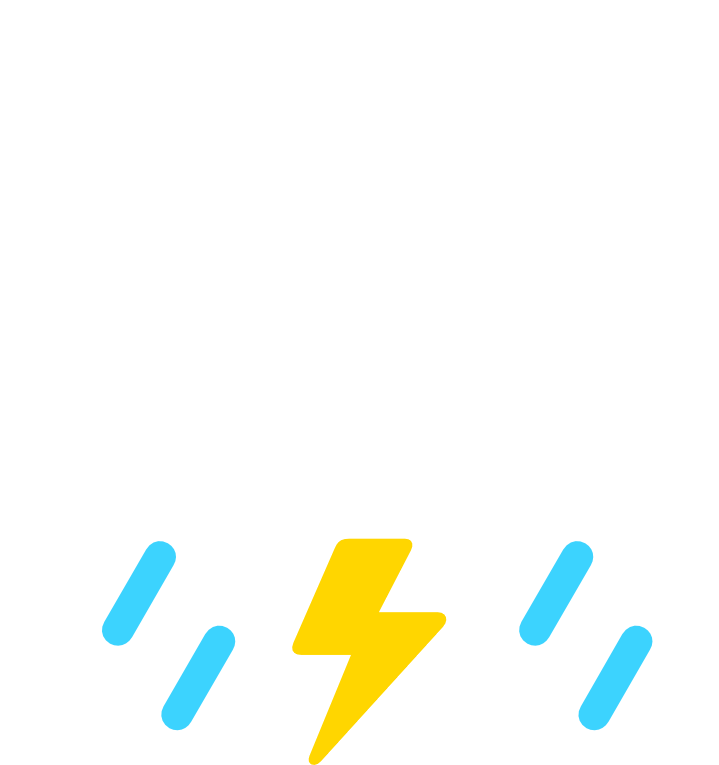 | `thunderstorm-rain` / `thunderstorm-rain.png` | Rain with lightning activity |
|  | `windy` / `windy.png` | Windy conditions |

Fallback mapping:

- Unknown keys fall back to `cloudy.png`

## State-Based Usage Notes

Based on `ProcessWeatherUpdate` logic in `MainWindowViewModel`:

- Active rain (no recent lightning): uses `rainy`
- Active rain with recent lightning: uses `thunderstorm-rain`
- Hail detected: uses `sleet`
- Dry lightning (lightning without rain): uses `thunderstorm`
- After precipitation/lightning clears: UI returns to forecast base icon (`BaseWeatherIcon`)

## Metric Icon Catalog

| Preview | File | Represents |
|---|---|---|
|  | `humidity-icon.png` | Humidity metric |
| 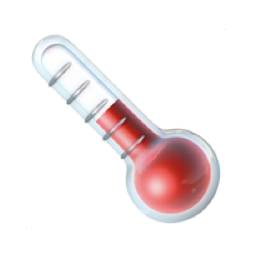 | `pressure-icon.png` | Pressure metric |
| 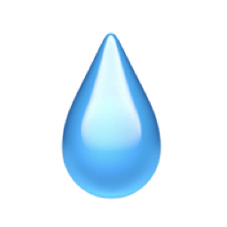 | `precip-icon.png` | Precipitation metric |
|  | `lightning-icon.png` | Lightning activity metric |
| 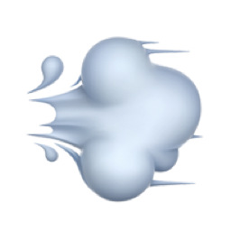 | `wind-icon.png` | Wind metric |
| 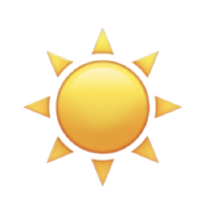 | `sun-icon.png` | UV / sun-related metric |
| 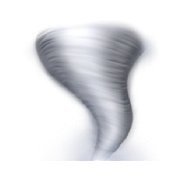 | `gust-icon.png` | Wind gust metric |

## Related

- [Home](Home)
- [Screenshots](Screenshots)