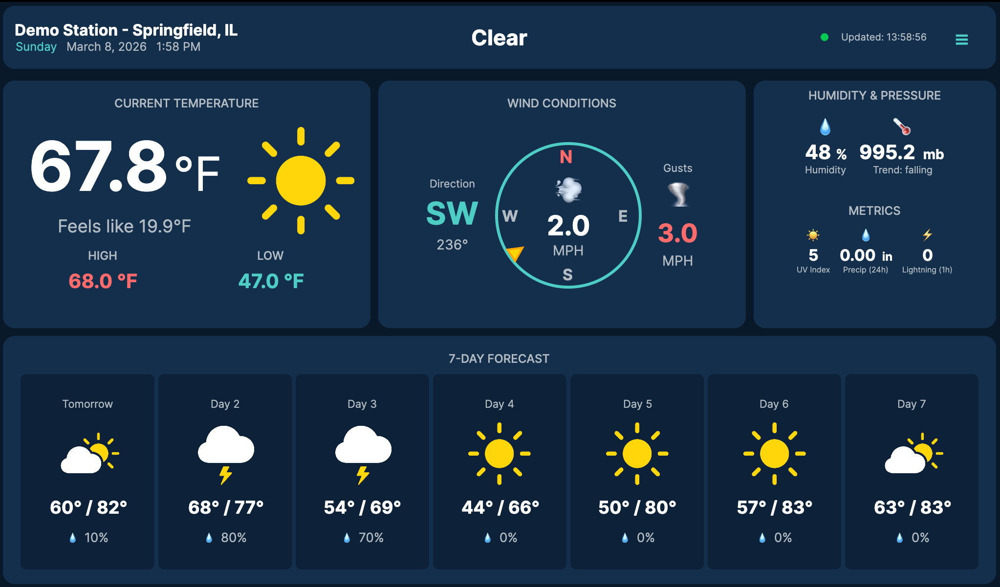
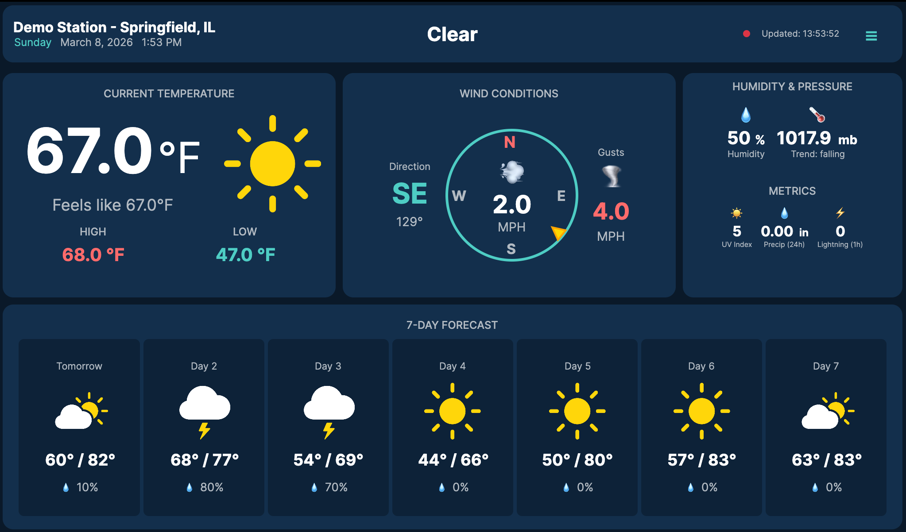
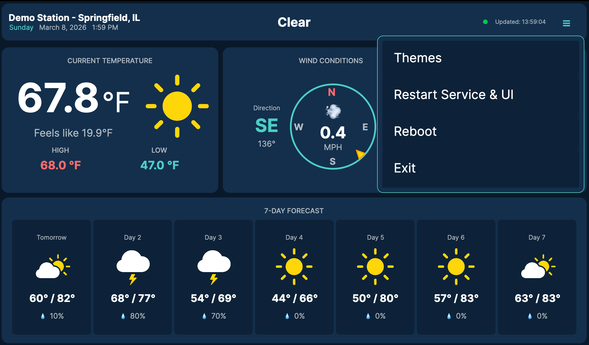
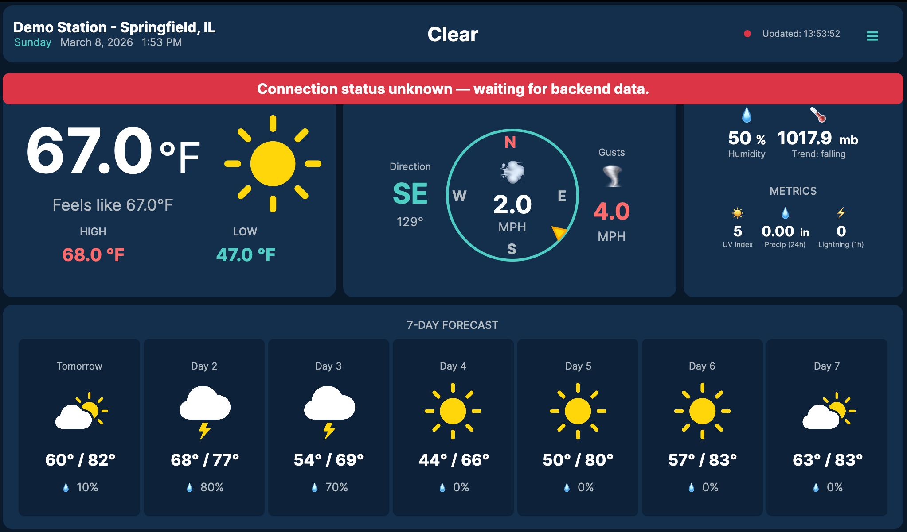
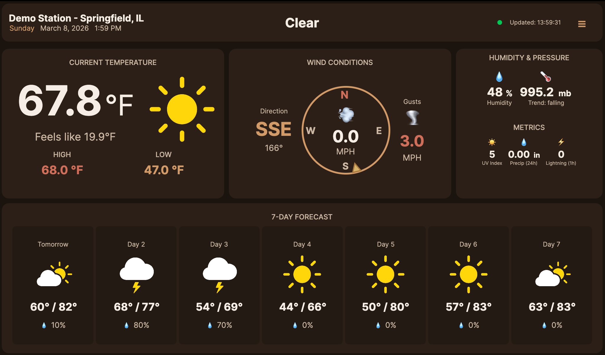
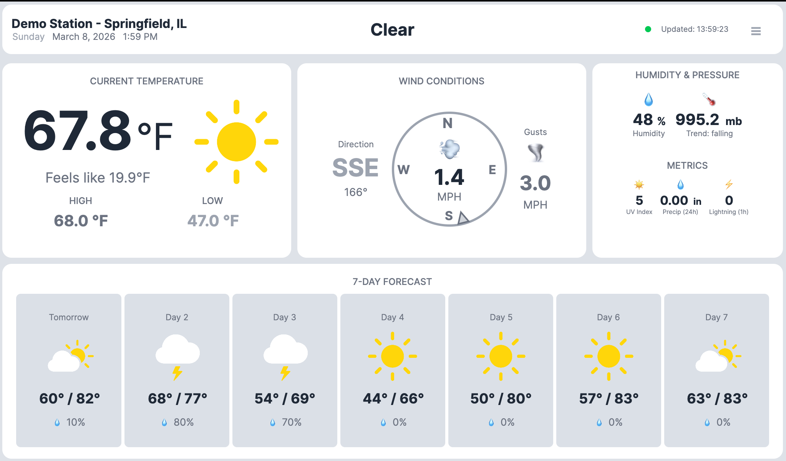
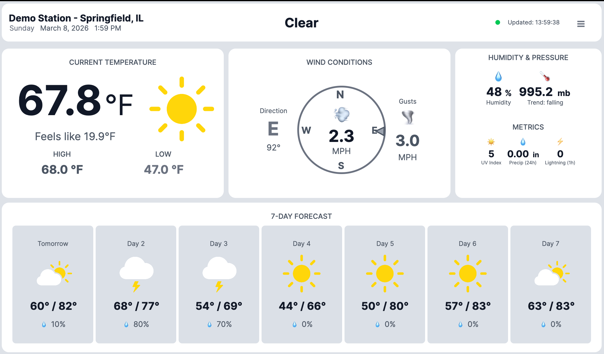
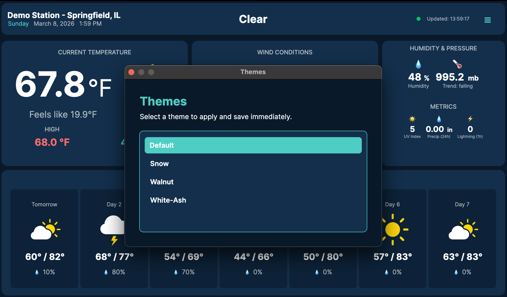

# Screenshots

This page is intended to show the app in real usage on Raspberry Pi.

## Current Status

Screenshot set has been added under `Wiki/images/`.

Expected image folder:

- `Wiki/images/` (see `Wiki/images/README.md`)

Suggested screenshot set:

1. Full dashboard in normal operation
2. Header menu open (Themes / Restart / Reboot / Exit)
3. Main dashboard with visible status/connection indicator
4. Theme variation examples (at least 2)
5. Theme menu focus view
6. Annotated quick-tour compatible captures

## Capture Guidance

- Captured set in repo: `2046x1202` (Retina-scale screenshot)
- UI logical layout target: `1024x600`
- Capture on device after data has streamed for at least 1 minute
- Avoid exposing API tokens or sensitive host info
- Use PNG for sharp text rendering

## Current Gallery


Caption: Primary dashboard view in the Default theme with healthy green connection indicator.


Caption: Same dashboard layout showing red connection indicator when UI is not receiving updates.


Caption: Header menu showing actions such as Themes, Restart, Reboot, and Exit.


Caption: Status messaging state for connectivity/health context.


Caption: Walnut theme variant.


Caption: Snow theme variant.


Caption: White Ash theme variant.

Theme note:

- `Snow` and `White-Ash` are intentionally very close.
- The main difference is the shade of darker greys.
- `White-Ash` was created for displays where the default greys were difficult to distinguish.


Caption: Theme selection menu in focus.

## Example Markdown Snippets

```md


```

## Icon Reference

For the complete icon catalog with consistent sizing and descriptions, see:

- [Icon Legend](Icon-Legend)

## Related

- [App Overview and Features](App-Overview)
- [Install on Raspberry Pi](Install-on-Raspberry-Pi)
- [Quick Tour (Annotated UI Walkthrough)](Quick-Tour)
- [Icon Legend](Icon-Legend)
